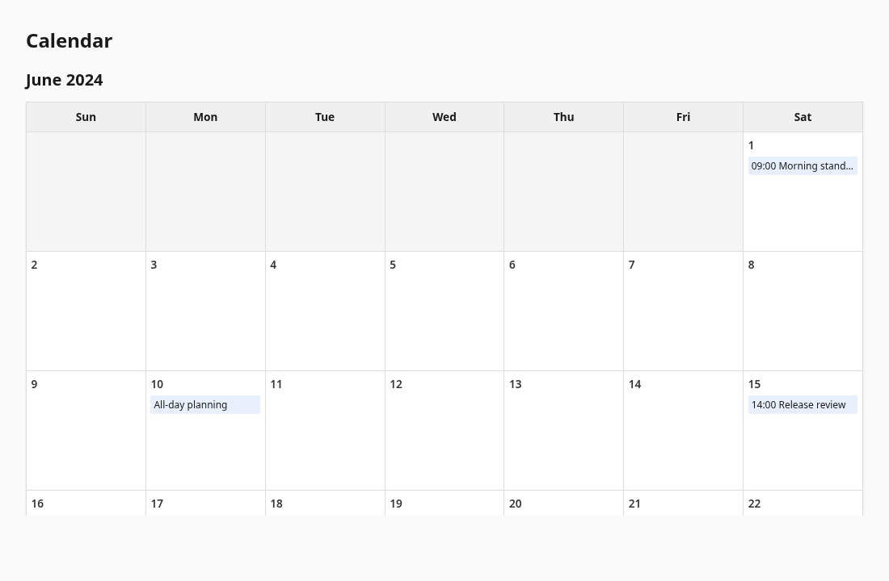
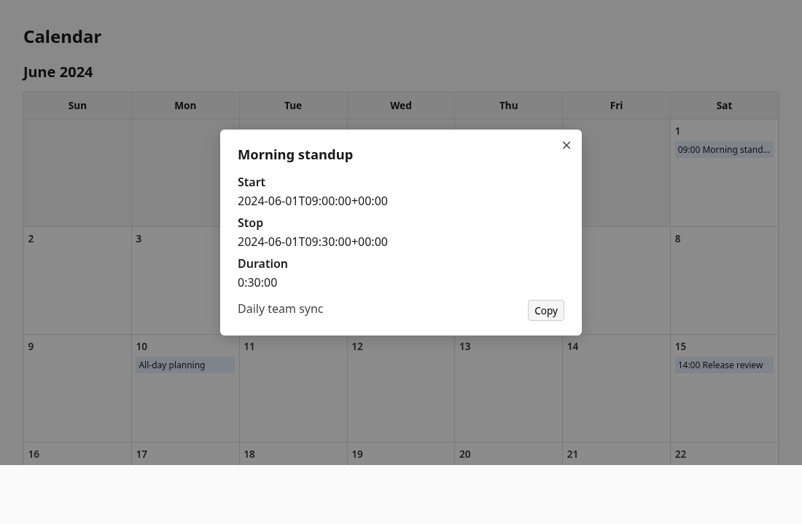
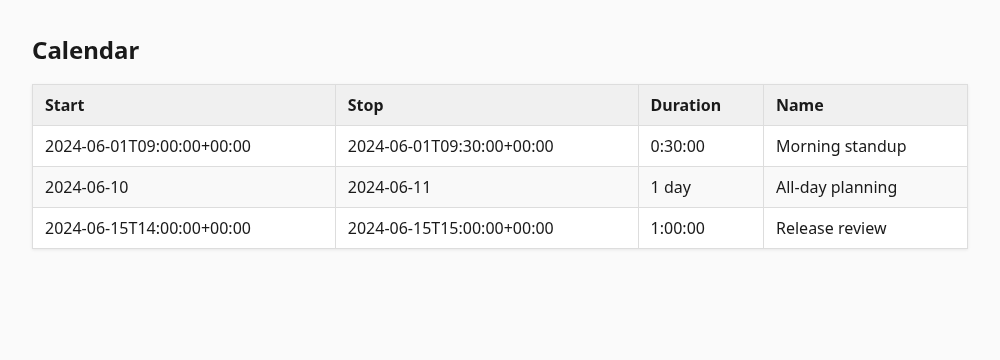
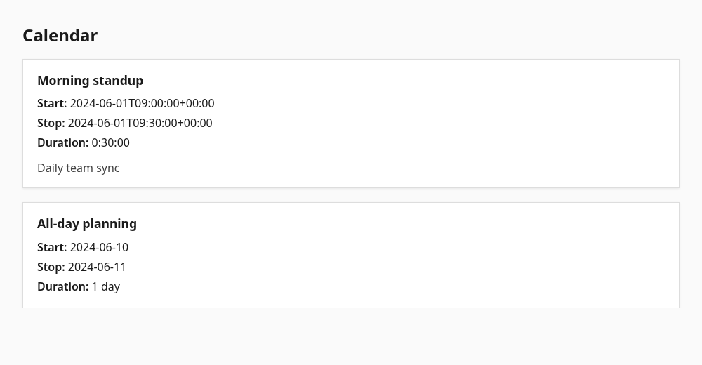

[](https://pypi.org/project/ics-render/)
[](https://pypi.org/project/ics-render/)
[](https://www.python.org/)

# Overview

Parse one or more ICS calendar files, merge their events, sort by start time, and print the result in several formats.

# Install

```bash
python -m venv .venv
source .venv/bin/activate
pip install -e ".[dev]"
```

# Basic usage

`--filepath` is required and may be repeated. Paths are read in order; events from every file are combined and sorted by start time.

```bash
ics_render --filepath calendar-a.ics --filepath calendar-b.ics
```

Without an output flag, `ics_render` prints a text table to stdout.

# Output modes

Output format flags are mutually exclusive. Pick one per run.

## Default text table

Sorted columns: **Start**, **Duration**, **Name**.

```bash
ics_render --filepath tests/fixtures/early.ics --filepath tests/fixtures/late.ics
```

```text
Start                      Duration    Name
-------------------------  ----------  ----------------
2024-06-01T09:00:00+00:00  0:30:00     Morning standup
2024-06-10                 1 day       All-day planning
2024-06-15T14:00:00+00:00  1:00:00     Release review
```

## JSON Lines (`--jsonl`)

Each event is one JSON object on its own line. Keys are lower-case, underscore-separated names taken from the original VEVENT properties (`summary`, `start`, `end`, and so on). Timestamp values use ISO 8601.

```bash
ics_render --jsonl --filepath tests/fixtures/early.ics --filepath tests/fixtures/late.ics
```

```jsonl
{"summary": {"parameters": {}, "value": "Morning standup"}, "start": {"parameters": {}, "value": "2024-06-01T09:00:00+00:00"}, "end": {"parameters": {}, "value": "2024-06-01T09:30:00+00:00"}, "uid": {"parameters": {}, "value": "early-1@example"}, "description": {"parameters": {}, "value": "Daily team sync"}}
{"summary": {"parameters": {}, "value": "All-day planning"}, "start": {"parameters": {"value": "DATE"}, "value": "2024-06-10"}, "end": {"parameters": {"value": "DATE"}, "value": "2024-06-11"}, "uid": {"parameters": {}, "value": "late-2@example"}}
{"summary": {"parameters": {}, "value": "Release review"}, "start": {"parameters": {}, "value": "2024-06-15T14:00:00+00:00"}, "end": {"parameters": {}, "value": "2024-06-15T15:00:00+00:00"}, "uid": {"parameters": {}, "value": "late-1@example"}}
```

Redirect to a file:

```bash
ics_render --jsonl --filepath calendar.ics > events.jsonl
```

## HTML month grid (`--html`)

A self-contained HTML page with a traditional calendar layout: weeks as rows, days as columns (Sunday first), events listed inside each day cell. Timed events show `HH:MM` before the name.

When events span more than one month, a **Month** drop-down at the top switches between month grids. The visible grid stays in sync with the selection after refresh.

Click an event to open a detail modal (start, stop, duration, description). Use **Copy** beside the description to copy it to the clipboard; a **Copied** toast confirms success.

```bash
ics_render --html --filepath tests/fixtures/early.ics --filepath tests/fixtures/late.ics > calendar.html
```





Open in a browser:

```bash
xdg-open calendar.html
```

## HTML table (`--html-table`)

A self-contained HTML page: one table row per event with **Start**, **Stop**, **Duration**, and **Name**. Hover the name to see the description as a tooltip.

```bash
ics_render --html-table --filepath tests/fixtures/early.ics --filepath tests/fixtures/late.ics > calendar-table.html
```



## HTML list (`--html-list`)

A self-contained HTML page: each event is a spaced block with name, start, stop, duration, and the full description at the bottom (newlines rendered as line breaks).

```bash
ics_render --html-list --filepath tests/fixtures/early.ics --filepath tests/fixtures/late.ics > calendar-list.html
```



# Tests

```bash
python -m pytest -q
```

# Regenerating README screenshots

Screenshots under `asset/screenshots/` are produced from the test fixtures using Brave in headless mode:

```bash
./make_screenshots
```

Requires `brave` (or adjust the browser command in the script). Intermediate `.html` files in `asset/screenshots/` are updated at the same time. Text table and JSONL examples in this README are sample output from the same fixtures.
